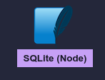

# Connecting with database

## Installation of Sqlite

To install sqlite you need two extintions they are :

- SQLTools
- SQLTools SQLite

## To connect to database

After installing the extiontions, click the cylinder icon () on the right side menu.

Now click "_Add connections button_"


Now click "_SQLite (Node)_"



Now give a name in "_Connection name_" column and then click "_select file_" and select your .db file in our case it is "_base.db_" then click test connection.

Now you will get reload button at the bottom right coner, after that repate above process again and now you will get install button in the bottom right coner

after that save the connecton and click "_connect now_"

## To create Table

```
    create table auth(id integer primary key, username varchar(255), passwd varchar(255));
    insert into auth values(1,"your name","your password");
    select * from auth;
```

if you have any issues please contact me.
